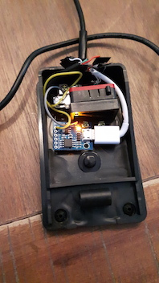

# Duco's sudo pedal

This project contains code and instructions for duco's sudo pedal. I gave this to him for his 50th birthday.

Duco has been talking about his idea for a pedal for quite some time. Recently, he brought it up again in slack:

I accepted the challenge.

## hardware

Ordered a pedal and a tiny arduino board from ebay.

They arrived two weeks later. 

I then stole the sturdiest and longest USB cable I could find in Darko & Matthijs' storage.

## assembly

I cut off the (big) USB device side connector. Cutting had to happen anyway, as it needed to pass the small hole in the pedal. 

I cut the micro-USB connector and some centimeters of wire from my personal phone charging USB cable, and soldered the 4 wires to the sturdy USB cable wires.

Soldered some wires from the pedal switch to 5V out and P0 pin of the ATTiny board.

It all came together nicely in the pedal:

## software

USB HID (human interface device) keyboard examples are pretty easy to find even in the standard arduino example set, but unfortunately these turned out not to be supported on this ATTiny_85 based board, which is a clone of the digispark kickstarter project. Fortunately, keyboard examples were found for this board easily, too. For this, you have to include DigiKeyboard.h.	

Software can be uploaded with the normal arduino software as soon as you have added the digispark board definitions.

## running

Once uploaded, the pedal is just a keyboard. If you press it, it adds 'sudo ' before your existing line. If you unpress it, it removes it again.

 I packed it up nice for Duco:
 
 
 
 

